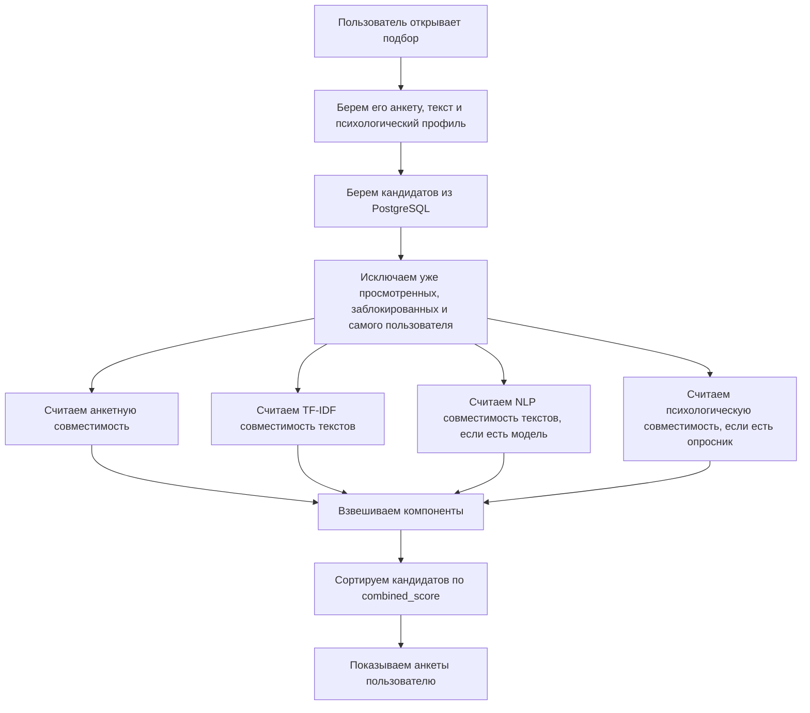
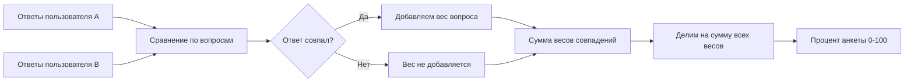
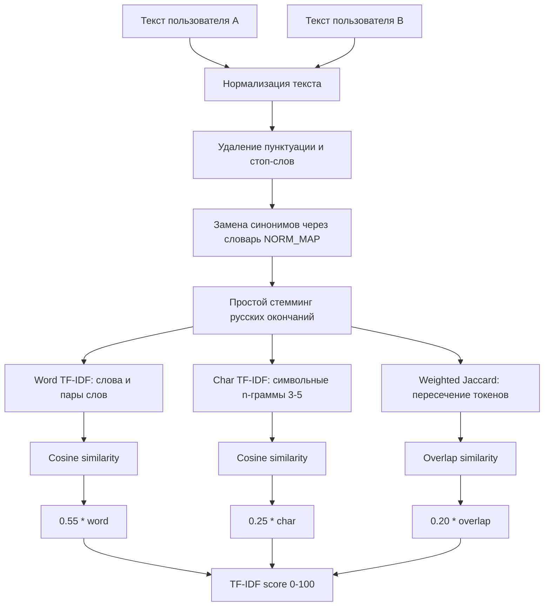
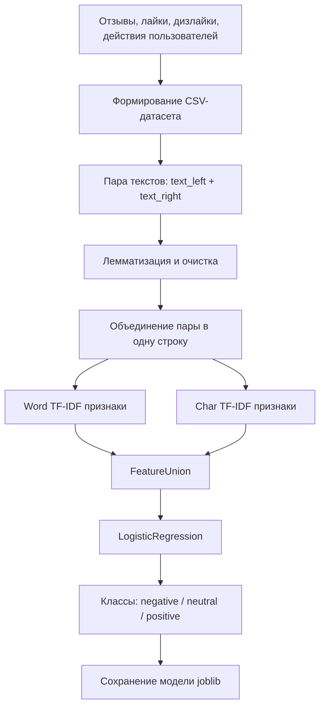
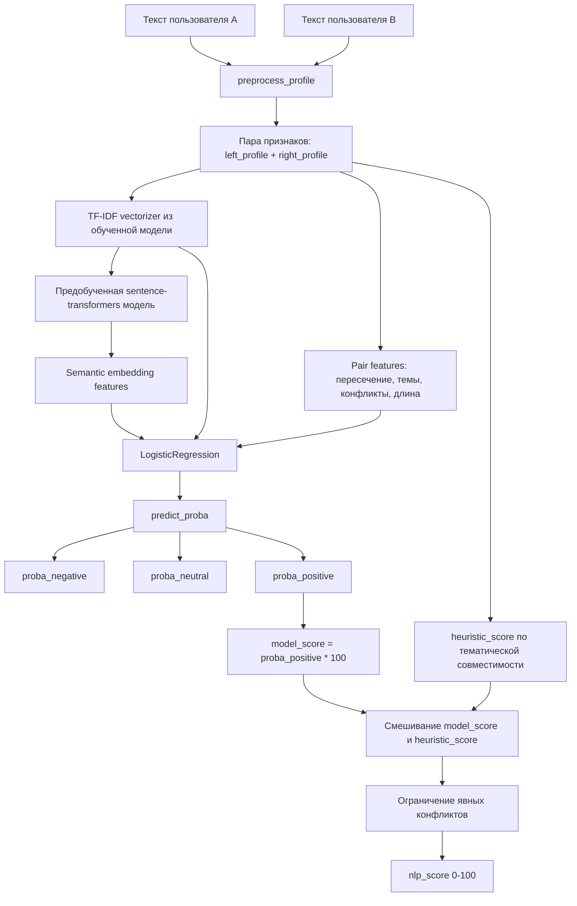
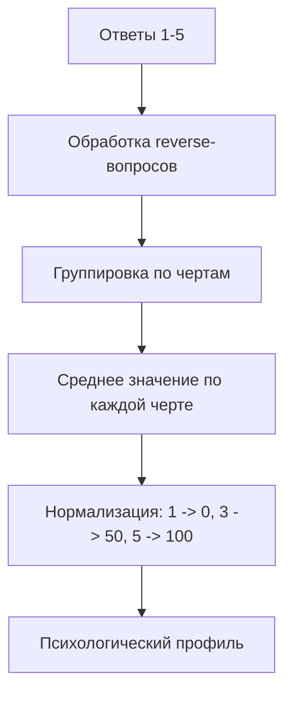
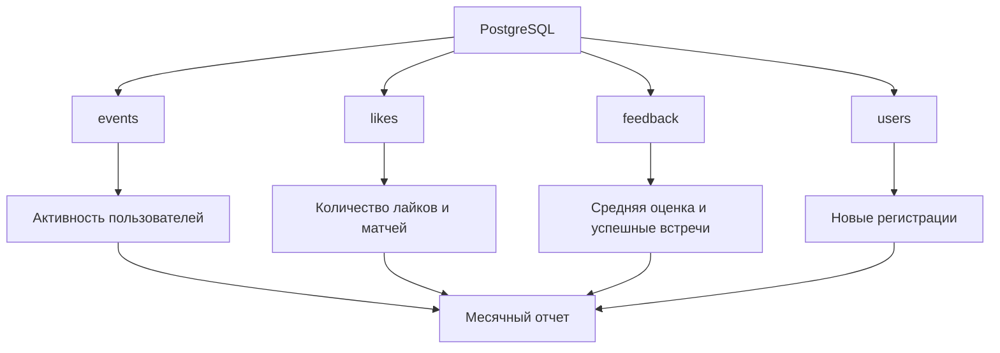
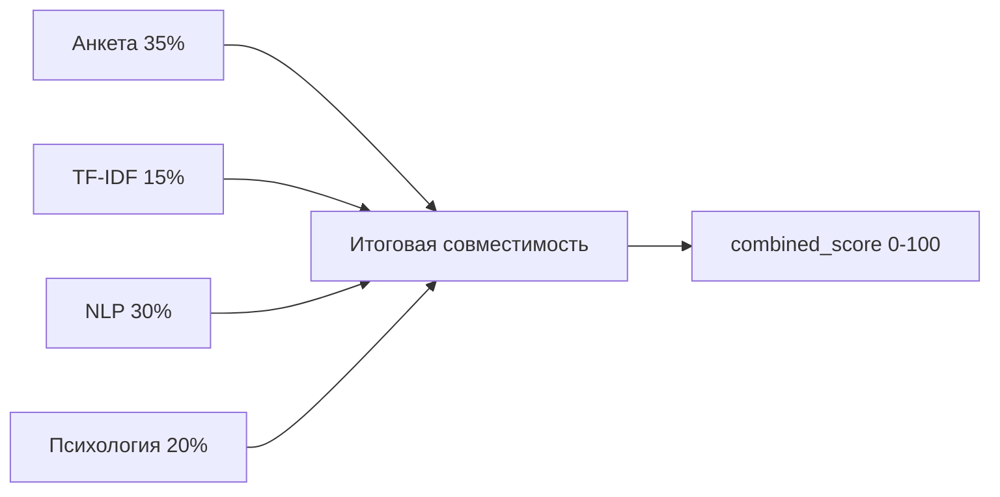

# Алгоритмы вычисления совместимости

Документ описывает, как в проекте рассчитывается процент совместимости, какие данные используются и какие библиотеки отвечают за обработку текста и NLP.

## Общая схема подбора



Итоговая оценка кандидата называется `combined_score`. Все компоненты приводятся к шкале от `0` до `100`.

## Веса в общем проценте

Текущая формула находится в `src/matching.py`.

| Компонент | Вес | Когда участвует |
|---|---:|---|
| Анкета | `0.35` | Всегда |
| TF-IDF текст | `0.15` | Всегда |
| NLP модель | `0.30` | Если обученная модель найдена |
| Психологический опросник | `0.20` | Если оба пользователя прошли опросник |

Формула:

```text
combined_score =
  (анкета * 0.35 + tfidf * 0.15 + nlp * 0.30 + психология * 0.20)
  / сумма_доступных_весов
```

Если NLP-модель или психологический профиль отсутствуют, их вес не учитывается, а итог пересчитывается по доступным компонентам.

Пример без психологии:

```text
combined_score = (анкета * 0.35 + tfidf * 0.15 + nlp * 0.30) / 0.80
```

## Нужно ли увеличивать вес TF-IDF

Сейчас TF-IDF имеет вес `0.15`, потому что он хорошо ловит буквальное совпадение интересов, но хуже понимает смысл. Например, фразы "люблю походы" и "обожаю путешествия" могут быть близки по смыслу, но не всегда совпадают по словам.

NLP имеет больший вес `0.30`, потому что модель обучается на пользовательских реакциях и может учитывать более сложные закономерности.

Возможный вариант для эксперимента:

| Компонент | Текущий вес | Вариант эксперимента |
|---|---:|---:|
| Анкета | `0.35` | `0.30` |
| TF-IDF | `0.15` | `0.25` |
| NLP | `0.30` | `0.25` |
| Психология | `0.20` | `0.20` |

Такой вариант делает текстовые совпадения более заметными в общем проценте. Его лучше проверять через A/B-сравнение: доля взаимных лайков, средняя оценка встречи, доля успешных матчей.

## Анкетная совместимость

Анкетная совместимость считается по совпадениям ответов. У каждого вопроса есть вес.



Вопросы и веса:

| Критерий | Ключ | Вес |
|---|---|---:|
| Образ жизни | `activity` | `1.2` |
| Стиль общения | `communication` | `1.0` |
| Приоритеты | `values` | `1.4` |
| Темп жизни | `tempo` | `0.8` |

Формула:

```text
questionnaire_score =
  сумма_весов_совпавших_ответов / сумма_всех_весов * 100
```

## TF-IDF совместимость

TF-IDF — это способ сравнить два текста по словам и фрагментам слов. Он не обучается на лайках, а математически сравнивает тексты профилей.

Используемые библиотеки:

- `scikit-learn`
- `TfidfVectorizer`
- `cosine_similarity`

### Схема TF-IDF



Итоговая формула TF-IDF:

```text
tfidf_score = (word_similarity * 0.55
             + char_similarity * 0.25
             + overlap_similarity * 0.20) * 100
```

Что означают части:

| Часть | Вес | Что ловит |
|---|---:|---|
| `word_similarity` | `0.55` | Совпадение слов и словосочетаний |
| `char_similarity` | `0.25` | Похожие формы слов, опечатки, общие корни |
| `overlap_similarity` | `0.20` | Прямое пересечение нормализованных интересов |

TF-IDF хорошо объясним: если у пользователей похожие слова, интересы и формулировки, процент выше.

## NLP совместимость

NLP в проекте — это обучаемая модель, которая предсказывает вероятность положительной совместимости по двум текстовым профилям.

Используемые библиотеки:

- `pymorphy2` и `pymorphy2-dicts-ru` — лемматизация русского текста;
- `sentence-transformers` — предобученная multilingual embedding-модель;
- `torch` и `transformers` — базовая инфраструктура для предобученной модели;
- `scikit-learn` — векторизация, обучение и метрики;
- `TfidfVectorizer` — превращение текста в числовые признаки;
- `FeatureUnion` — объединение разных наборов признаков;
- `LogisticRegression` — модель классификации;
- `joblib` — сохранение и загрузка модели;
- `accuracy_score`, `f1_score`, `classification_report`, `confusion_matrix` — оценка качества.

### Как обучается NLP-модель



В обучении используются пары текстов и метки:

| Метка | Что означает |
|---|---|
| `positive` | Пользователь положительно оценил кандидата |
| `neutral` | Нейтральный или неоднозначный пример |
| `negative` | Дизлайк, блокировка, жалоба или низкая оценка |

### Как NLP считает процент при подборе



Модель возвращает три вероятности:

```text
proba_negative = вероятность плохой совместимости
proba_neutral  = вероятность нейтральной совместимости
proba_positive = вероятность хорошей совместимости
```

Процент NLP теперь считается как смесь обученной модели и эвристики пары:

```text
model_score = proba_positive * 100
heuristic_score = оценка тематического совпадения и конфликтов
nlp_score = model_score * 0.55 + heuristic_score * 0.45
```

Дополнительно есть защитные правила:

- если эвристика видит явный конфликт, итоговый процент ограничивается;
- если эвристика видит сильное совпадение тематик, модель не может занизить пару слишком сильно.

Это нужно, потому что синтетический датасет полезен для начального предобучения, но может быть шумным. Реальные лайки и отзывы постепенно улучшают модель при дообучении.

### Это дерево решений?

Нет. Сейчас используется не дерево решений, а логистическая регрессия.

Логистическая регрессия получает TF-IDF признаки и дополнительные признаки пары. Упрощенно:

```text
z = w1*x1 + w2*x2 + ... + wn*xn + b
probability = sigmoid(z)
```

Где:

- `x1, x2, ..., xn` — признаки текста после TF-IDF и признаки пары;
- `w1, w2, ..., wn` — веса, которые модель выучила на обучающем датасете;
- `b` — свободный коэффициент;
- `probability` — вероятность класса.

Для трех классов модель считает вероятности `negative`, `neutral`, `positive`, а для процента совместимости используется именно `positive`.

### Дообучение

Модель считается предобученной на искусственном датасете из `exports/nlp_dataset_train.csv`. Реальные данные пользователя собираются в `data/nlp_training_data.csv` и добавляются при следующем обучении с повышенным весом.

```bash
python main.py tools train-text-model
```

или:

```bash
python train_nlp_model.py --real-weight 4
```

Смысл `real-weight`: один реальный пример учитывается сильнее синтетического, чтобы модель постепенно подстраивалась под поведение настоящих пользователей.

## Психологическая совместимость

Психологический опросник считает черты пользователя по шкале `0-100`.



Совместимость двух пользователей:

```text
diff_trait = abs(score_user_1 - score_user_2)
avg_diff = средняя разница по общим чертам
psychology_score = 100 - avg_diff
```

Чем ближе психологические показатели, тем выше процент.

## Текстовый процент внутри MatchResult

В `MatchResult` отдельно сохраняется `text_score`:

```text
text_score = 0.4 * tfidf_score + 0.6 * nlp_score
```

Если NLP-модель недоступна:

```text
text_score = tfidf_score
```

Важно: в итоговом `combined_score` сейчас используются отдельные компоненты `tfidf_score` и `nlp_score`, а не `text_score`.

## Отчет и инфографика для администратора

Для диплома можно описать отчет за месяц как отдельный модуль аналитики.



Показатели для отчета:

| Показатель | Источник |
|---|---|
| Новые пользователи за месяц | `users.registered_at` |
| Активные пользователи | `events` |
| Просмотры анкет | `events` с событием `browse_started` |
| Лайки | `likes` |
| Взаимные лайки | пары из `likes` |
| Отзывы | `feedback` |
| Средняя оценка встречи | `feedback.user_score` |
| Успешные встречи | `liked = 1` и `meeting_agree = 1` |
| Жалобы | `reports` |

Визуально это можно показать:

- линейный график активности по дням;
- столбчатая диаграмма лайков и матчей;
- круговая диаграмма исходов отзывов;
- карточки с KPI: пользователи, лайки, матчи, средняя оценка.

## Тестирование для диплома

Тестирование можно описать тремя уровнями.

### 1. Автоматическое тестирование

В проекте есть интеграционный тест:

```bash
python test_nlp_integration.py
```

Он проверяет:

- импорт NLP-модулей;
- предобработку текста;
- извлечение ключевых слов;
- сбор NLP-данных;
- расчет метрик;
- доступность служебных скриптов;
- загрузку модели, если она обучена.

### 2. Smoke-тестирование запуска

Проверяется, что:

- PostgreSQL поднимается через `docker compose up -d postgres`;
- приложение подключается к `DATABASE_URL`;
- схема создается автоматически;
- `python main.py --help` и `python main.py tools --help` работают;
- бот запускается без ошибок конфигурации.

### 3. Ручное пользовательское тестирование

Сценарии для друзей/тестировщиков:

1. Запустить диалог с ботом.
2. Заполнить анкету.
3. Добавить текстовое описание.
4. Пройти психологический опросник.
5. Посмотреть анкеты других пользователей.
6. Поставить лайк/дизлайк.
7. Получить взаимный матч.
8. Оставить отзыв после матча.
9. Проверить, что блокировка скрывает пользователя.
10. Проверить, что жалоба появляется в админском списке.

Примеры ошибок, которые можно описать в дипломе:

| Ошибка | Как обнаружили | Как исправили |
|---|---|---|
| Не сохранялся черновик анкеты | Пользователь прервал заполнение | Добавлено сохранение состояния в `user_drafts` |
| Повторно показывались просмотренные анкеты | Ручной просмотр нескольких кандидатов | Добавлена фильтрация по `likes` и `dislikes` |
| NLP давал слишком резкие проценты | Проверка на малом датасете | Добавлена калибровка `50 + (score - 50) * 0.55` |
| Дубликаты отзывов и лайков | Повторное нажатие кнопок | Добавлены `UNIQUE`-ограничения и `ON CONFLICT DO NOTHING` |

## Краткая итоговая схема формулы



Текущая логика хорошо подходит для диплома, потому что сочетает:

- объяснимые правила анкеты;
- математическое сравнение текстов через TF-IDF;
- обучаемую NLP-модель на действиях пользователей;
- психологический профиль;
- итоговую прозрачную формулу весов.
